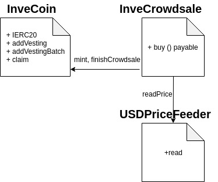

# InveCoin Smart contracts

## Description

The smart contracts in this directory implement the in-chain-environment for Investoland. Its mainly composed of an ERC20 with some extra features and a crowdsale with some particularities.

The ERC20 tokens has the following extra features:

- It's pausable

- It support vesteable tokens, which means that some tokens will only be able to be used after a predefined amount of time

- It allows the minters to mint and add vesteable tokens as long as the crowdsale is still active

- The contract is paused while the crowdsale is active

The crowdsale has:

- A custom price law

- The capacity to add vested tokens

- A discount based on the amount paid in the transaction

- A time cap

- A funding cap in USD

- A time cap

## Usage

This is an npm package, so you should have npm and node already installed. If you did it with nvm you can type

> nvm use

to set the node version correctly. If not you can look the exact version in the file .nvmrc .

### Installation

You can install the dependencies necessary to use it running

> npm install

### Tests

Run the tests using

> npm test

This includes the linter for the contracts as welll as for the tests code. It, obviously, run the tests made for the
smart contracts which follow the Gherkin notation.

### Deploy

To deploy this contract you can use the script provided which uses truffle, so you should have the package installed, but before that it is **VERY IMPORTANT** to **change the config(./migrations/deploy_config.js) file** where you can set the wallet in which you will receive the raised funds. There you can set other params of the crowdsale such as opening time, closing time, discount rows(this has a default table, based on the shared spreadsheet of discounts) and the percentage of tokens the company will get. (Note that every dollar passed as a param should be multiplied by PRECISION, found in the Config, because the contract uses fixedPoint numbers for the dollar). **NOTE: As the oraclizePriceFeeder only worked in Ethereum blockchains the price requested by it is the price of the ether, if you will deploy this to RSK change the URL. You can test it [here](http://app.oraclize.it/home/test_query)**

Instructions:

- Customize the configs above mentioned

- Set the network you are going to use's params in ./truffle.js

- Set the mnemonic of an account with funds in ./truffle.js,
  this account will be the owner of the deployed contracts

- Run `npm run deploy -- --network <network-name>`. This will deploy the [three involved smart contracts](#Deployed-SCs) and link them together, i.e. the contracts will be almost ready to be used. You should save the address of the deployed contracts somewhere, you should be able to see them in the output give by the previous command.

Before and during the crowdsale are some things you have to set up yet:

- Add the vesting tokens for each address in InveCoin.
  You can do this by calling the method addVesting[^1] or addVestingBatch which receive, in order, the address which will be able to claim the tokens, the amount of tokens, the number of months the user has to wait from the finish of the crowdsale until he is able to start claiming his tokens and the number of months the user has to wait from the finish of the crowdsale until he is able to claim all of his tokens. The difference between each one, is that the first receives one of each parameter and the other receives 4 arrays to do that in a batch.

- Add the whitelisted address in the crowdsale contract (you can do this every time you want, you can even do it on demand).
  You can do this by calling addWhitelisted[^1], it receives a single parameter which is the address that will be able to receive tokens from in the crowdsale.

- Start the USDPriceFeeder updatig process. Note that this process transfer a fee set by Oraclize so you should transfer that amount times the number of times to run it. When the contracts runs out of ether to run it, it will simply stop updating and you should restart it giving it more gas.
  You can do this by calling updatePrice[^1] in the USDPriceFeeder and transfering to the contract the anount afore mentioned.

- Wait until the crowdsale is able to finish, you can check if it finished with the method crowdsaleHasFinished[^1] in the crowdsale contract

- Call the finish[^1] method in the crowdsale contract, this will distribute the company's tokens, unpause InveCoin and start vesting the tokens

[^1]: To call any function inside a contract you can do it using node with a web3 provider. You should also have a blockchain node that can broadcast the transactions you send and a wallet provider that can send said transactions.

Once you have this you should import the contract you are trying to interact with (look at the folder build, there you can find the abis inside a json for each compiled contract) and know the address of the contract you are trying to call. The frontend does exactly this, you can look in the WalletService.js for more guidance.

##### Deployed SCs

